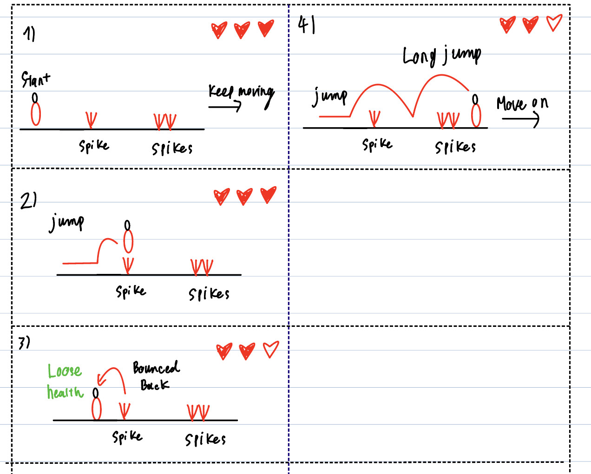
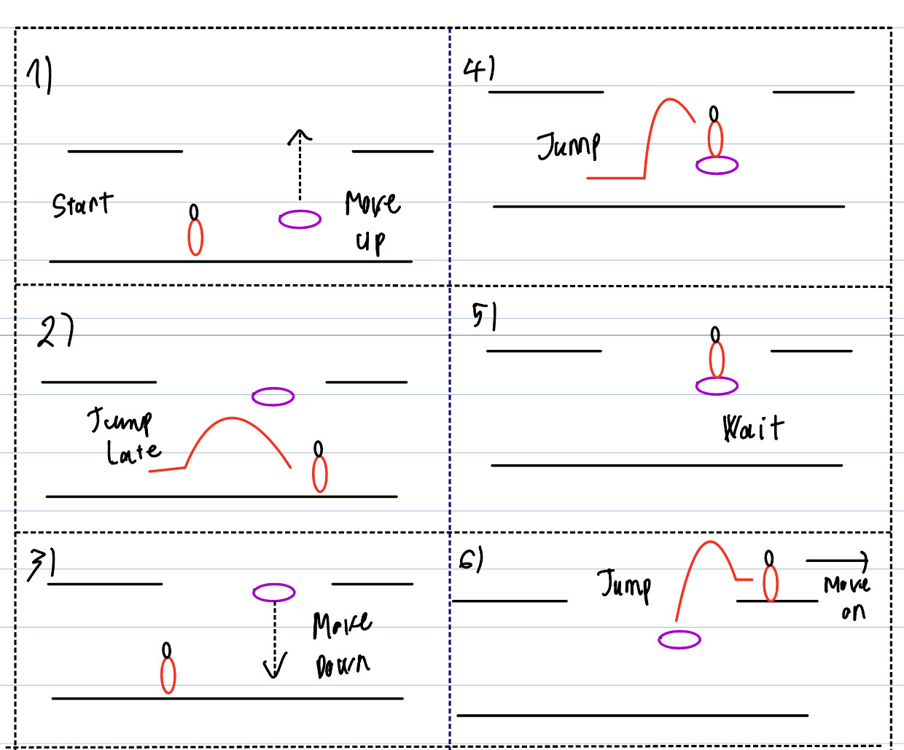
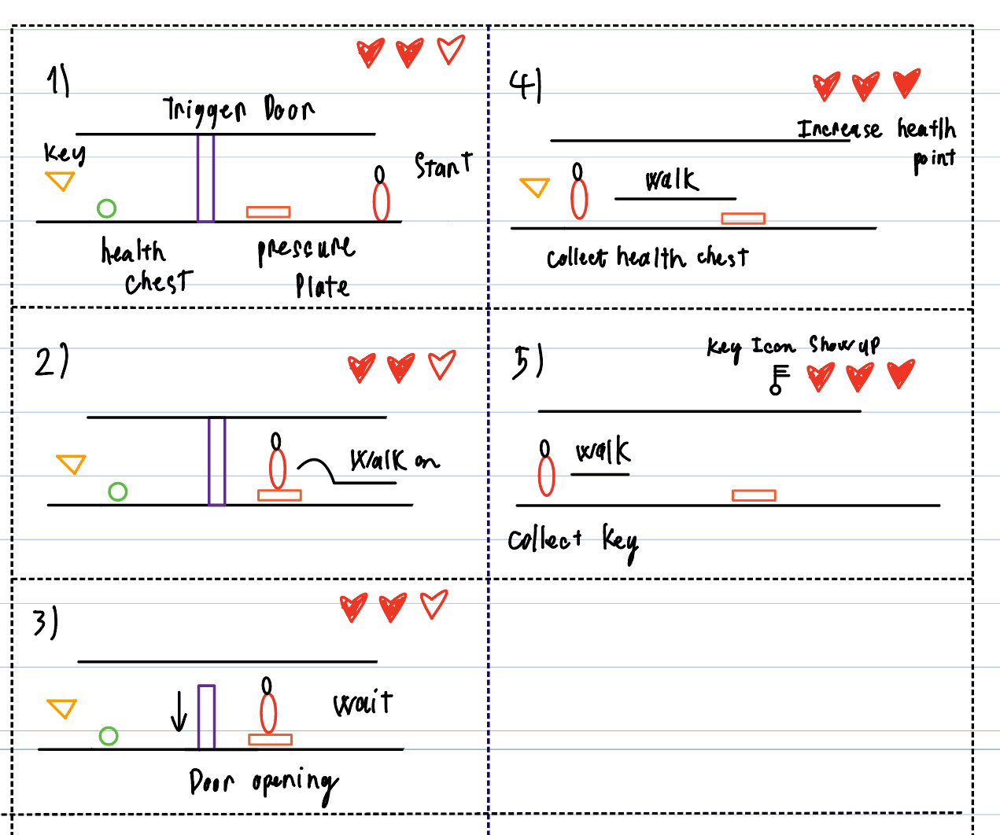
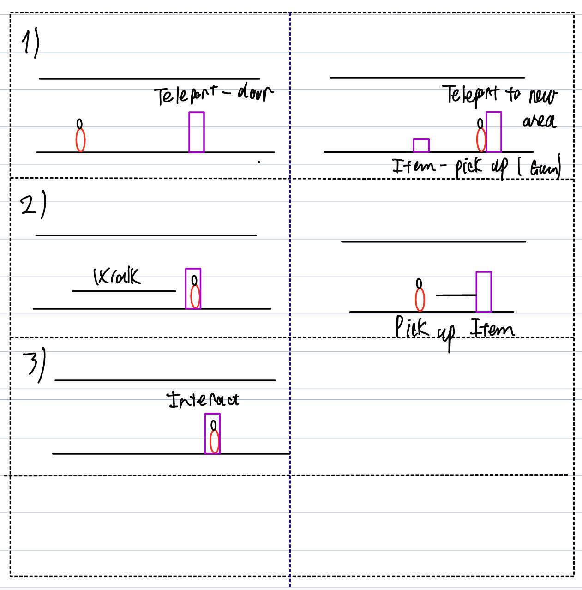
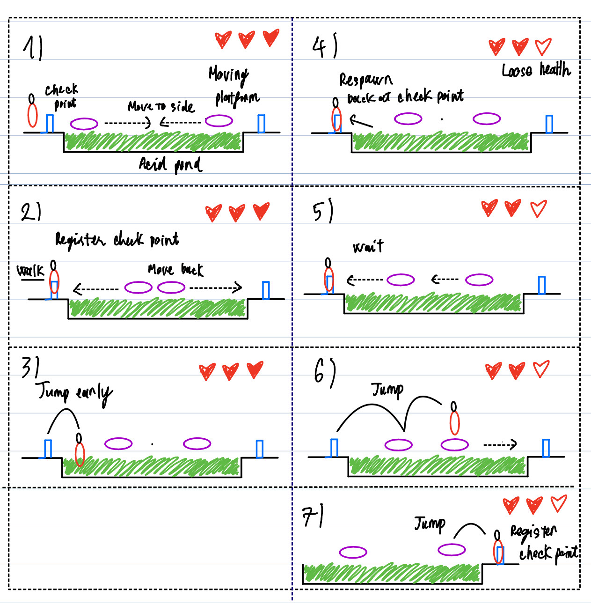

[](https://classroom.github.com/a/YyUO0xtt)
# COMP2150  - Level Design Document
### Name: Khuu Chi Cuong
### Student number: 46803513

This document discusses and reflects on the design of your platformer level for the Level Design assessment. It should be 1500 words. Make sure you delete this and all other instructional text throughout the document before checking your word count prior to submission. Hint: You can check word count by copying this text into a Word or Google doc.

Your document must include images. To insert an image into your documentation, place it in the "DocImages" folder in this repo, then place the below text where you want the image to appear:

```

```

Example:


## 1. Player Experience (~700 words)
Outline and justify how your level design facilitates the core player experience goals outlined in the assignment spec. Each section should be supported by specific examples and screenshots of your game encounters that highlight design choices made to facilitate that particular experience.

### 1.1. Discovery
What does the player learn? How does your encounter and broader level design facilitate learning in a way that follows good design practice?
The player will learn different inputs and any encounter that exists in the game. By dividing into 3 different stages, we can effectively make the player's learning curve 

### 1.2. Drama
What is the intensity curve? How does your design facilitate increasing yet modulating intensity, with moments of tension and relief? 

The more the play explore into the level, the more intense gameplay it is for the player to experience. In stage 1 of the level, player will be introduced and allowed to get to use to different control-buttons. Most of the challenges in stage 1 will leads to a health pick-up and a dead end situation; this forces the player to take 2-3 seconds to head to the next challenges, hence, it will create an invisible momments of relief for the players and allow them to reinforce the knowledge they learned in previous challenges. In stage 2, the game will introduce more challenging encounters but this stage is focused on discovery and puzzle since i located this stage in the middle of the level. Therefore, the player will experience and understand the full map layout while expereince stage 2. In this stage, the instense and the difficulty will rise when the player have to face a number of enemy in a restricsted space. An easy puzzle is also included in this stage to introduce player to a different aspect of the game; hence, create another moment of relief after intense encounters. In stage 3, the intensity will be pushed to the top with different challenging encounters such as enimies and parkour area forced player to focus to be able to pass this level. 

### 1.3. Challenge
What are the main challenges? How have you designed and balanced these challenges to control the difficulty curve and keep the player in the flow channel?

There are 5 challenges in the game:
1st avoid spikes
2nd kill gromper
3rd solve puzzle
4th parkour through encouters
5th kill spitter

The difficulty is devided into 3 stages according to esay, medium, and hard. In stage 1, most of the challenges focused on introduce player to control buttons. Hence the difficaulty to tuned down to easy, by providing obvious solution, and many health pick-up. The difficulty will be unted to medium when player have to deal with enemy in tight and restricted space. In this stage, most of gampley is till introduce player to harder encounters and mechanics. In stage 2, the goal is still to help players develop their full understanding on tools that are available to them. At the end of stage 2, player will learn most of the mechanics avaiable and provided a long relief period for player to reinforce their knowledge, before heading to the most challenging stage. In stage 3, the player need to apply different skills such as timing and quick-reflects. 


### 1.4. Exploration

How does your level design facilitate autonomy and invite the player to explore? How do your aesthetic and layout choices create distinct and memorable spaces and/or places?
The level is designed with exploration in mind so negative spaces are in most the stages, and due to the play-time limit 5-6 mintues. So i decide to make stage 2 is a bridge help players to gain a grapse of what the whole level looks like and where to find the last key. PLayer also have the options to not explore and try to focus on complete the stage by ignore some of the encounters, but it will limit the loot that player gain. 


## 2. Core Gameplay (~400 words)
A section on Core Gameplay, where storyboards are used to outline how you introduce the player to each of the required gameplay elements in the first section of the game. Storyboards should follow the format provided in lectures.

Storyboards can be combined when multiple mechanics are introduced within a single encounter. Each section should include a sentence or two to briefly justify why you chose to introduce the mechanic/s to the player in that sequence.

You should restructure the headings below to match the order they appear in your level.

### 2.1. Spikes

I choose the spikes to be the first encounter to help player get use to the movement tech (such as jump, long jump). It is also in the first stage so it should be straight forward. But spikes also used through out the level to rise the instensity of the gameplay by combining with other encounters

### 2.2. Move Moving Platform

Moving platform is introduced in stage 1 as a tools to explore the level. This is a simple encounter that help the player understand how moving platform works. Hence it also used in stage 3 to test the player timing and quick reaction.

### 2.3. Health Pickup and Key


### 2.4. Weapon Pickup (staff) and Chomper


### 2.5. Move Through Platform


### 2.6. Teleport-door and Weapon Pickup(Gun)


### 2.7. Checkpoint and Acid


### 2.8. Spitters


## 3. Spatiotemporal Design
A section on Spatiotemporal Design, which includes your molecule diagram and annotated level maps (one for each main section of your level). These diagrams may be made digitally or by hand, but must not be created from screenshots of your game. The annotated level maps should show the structure you intend to build, included game elements, and the path the player is expected to take through the level. Examples of these diagrams are included in the level design lectures.

No additional words are necessary for this section (any words should only be within your images/diagrams).
 
### 3.1. Molecule Diagram

### 3.2. Level Map – Section 1

### 3.3.	Level Map – Section 2

### 3.4.	Level Map – Section 3

## 4. Iterative Design (~400 words)
Reflect on how iterative design helped to improve your level. Additional prototypes and design artefacts should be included to demonstrate that you followed an iterative design process (e.g. pictures of paper prototypes, early grey-boxed maps, additional storyboards of later gameplay sequences, etc.). You can also use this section to justify design changes made in Unity after you drew your level design maps shown in section 3. 

You should conclude by highlighting a specific example of an encounter, or another aspect of your level design, that could be improved through further iterative design.

## Generative AI Use Acknowledgement

Use the below table to indicate any Generative AI or writing assistance tools used in creating your document. Please be honest and thorough in your reporting, as this will allow us to give you the marks you have earnt. Place any drafts or other evidence inside this repository. This form and related evidence do not count to your word count.
An example has been included. Please replace this with any actual tools, and add more as necessary.


### Tool Used: ChatGPT
**Nature of Use** Finding relevant design theory.

**Evidence Attached?** Screenshot of ChatGPT conversation included in the folder "GenAI" in this repo.

**Additional Notes:** I used ChatGPT to try and find some more relevant design theory that I could apply to my game. After googling them, however, I found most of them were inaccurate, and some didn't exist. One theory mentioned, however, was useful, and I've incorporated it into my work.

### Tool Used: Example
**Nature of Use** Example Text

**Evidence Attached?** Example Text

**Additional Notes:** Example Text


