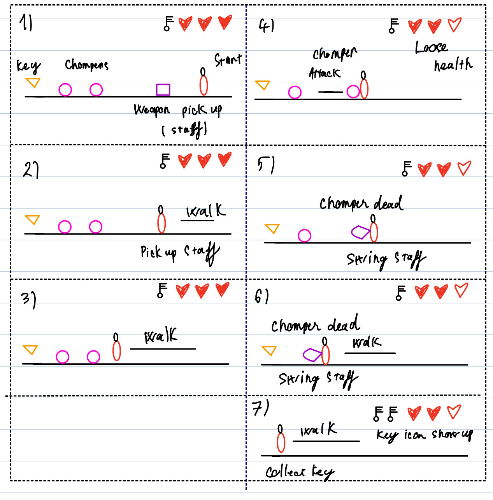
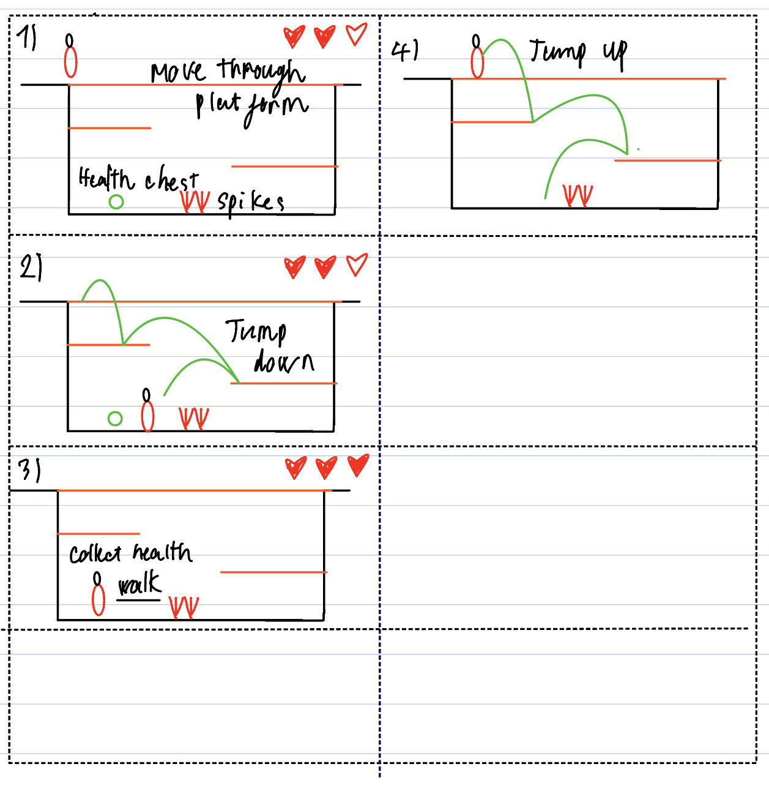

# COMP2150  - Level Design Document
### Name: Khuu Chi Cuong
### Student number: 46803513

## 1. Player Experience 

### 1.1. Discovery

The player will learn different inputs and any encounter that exists in the game. By dividing into 3 different stages, we can effectively make the player's learning curve going up slowly. The goal of this level is to introduce player to new mechanics yet also challenge player in later sections of the level. In the first stage, it is a simple stage which the goal is to introduce movement specs, and new mechanics to the players

In the Second stage, player have to try a bit harder to avoid damage and traverse through the second stage. In this stage, the player will apply their movement that they learned to a new level as the same time getting use to new mechanics that the game has to offer. 

In the Third stage, this is the stage where player need to focus and use what they learned to traverse through multiple hard sections.

### 1.2. Drama
The more the play explore into the level, the more intense gameplay it is for the player to experience. In stage 1 of the level, player will be introduced and allowed to get to use to different control-buttons. Most of the challenges in stage 1 will leads to a health pick-up and a dead end situation; this forces the player to take 2-3 seconds to head to the next challenges, hence, it will create an invisible momments of relief for the players and allow them to reinforce the knowledge they learned in previous challenges. In stage 2, the game will introduce more challenging encounters but this stage is focused on discovery and puzzle since i located this stage in the middle of the level. Therefore, the player will experience and understand the full map layout while expereince stage 2. In this stage, the instense and the difficulty will rise when the player have to face a number of enemy in a restricsted space. An easy puzzle is also included in this stage to introduce player to a different aspect of the game; hence, create another moment of relief after intense encounters.

In stage 3, the intensity will be pushed to the top with different challenging encounters such as enimies and parkour area forced player to focus to be able to pass this level. 

### 1.3. Challenge
There are 5 challenges in the game:
1st avoid spikes
2nd kill gromper
3rd solve puzzle
4th parkour through encouters
5th kill spitter

The difficulty is devided into 3 stages according to esay, medium, and hard. In stage 1, most of the challenges focused on introduce player to control buttons. Hence the difficaulty to tuned down to easy, by providing obvious solution, and many health pick-up. 

The difficulty will be unted to medium when player have to deal with enemy in tight and restricted space. In this stage, most of gampley is till introduce player to harder encounters and mechanics. In stage 2, the goal is still to help players develop their full understanding on tools that are available to them. At the end of stage 2, player will learn most of the mechanics avaiable and provided a long relief period for player to reinforce their knowledge, before heading to the most challenging stage. In stage 3, the player need to apply different skills such as timing and quick-reflects. 

### 1.4. Exploration

The level is designed with exploration in mind so negative spaces are in most the stages, and due to the play-time limit 5-6 mintues. So i decide to make stage 2 is a bridge help players to gain a grapse of what the whole level looks like and where to find the last key. PLayer also have the options to not explore and try to focus on complete the stage by ignore some of the encounters, but it will limit the loot that player gain. 

## 2. Core Gameplay

### 2.1. Spikes

I choose the spikes to be the first encounter to help player get use to the movement tech (such as jump, long jump). It is also in the first stage so it should be straight forward. But spikes also used through out the level to rise the instensity of the gameplay by combining with other encounters

### 2.2. Move Moving Platform

Moving platform is introduced in stage 1 as a tools to explore the level. This is a simple encounter that help the player understand how moving platform works. Hence it also used in stage 3 to test the player timing and quick reaction.

### 2.3. Health Pickup and Key

Health Pick-up and key is introduced in the middle of stage 1. It will introduce player to the main goal of the level early on of the level. Therefore, player will understand the level main task and forced to explore for more key. 

### 2.4. Weapon Pickup (staff) and Chomper

Weapon (staff) is introduced right in front of enemies so that player will be less likely to be confused of what they just interacted with. Chomper is the best encounters at the end of stage one to alert and rise player anttention for the next two stage; since stage 1 are on the easiest level. This creates a feeling of danger waiting a head of them

### 2.5. Move Through Platform

At the begging of stage 2, move through platform is the fist encounter player will faced, but in this stage the difficulty will be tuned up a bit, and player have to work with tight spaces and aggressive chompers while interact with move through platform

### 2.6. Teleport-door and Weapon Pickup(Gun)

The teleport door is introduced in this stage to introduce player to more advanced encounters for later on level. This is also an option path that player can choose to ignore since it doesn't affect the abitlity to complete the level of the player. But the player will be awarded with a Gun and health point if they choose to exlpore futher into the stage. 

### 2.7. Checkpoint and Acid

This is where stage 3 begins and the intensity need to be rise up to the max. Therefore I think acid is the best suit for this sitatuion. A large area full of acid and the only way to advance forward is to jump on 2 different moving platform. If they fall they will forced to return to the checkpoint. 

### 2.8. Spitters

Spitter is a great ending for the levels since it harder to deal with than a chomper and the projectiles which may supprise players that come unprepare.

## 3. Spatiotemporal Design

### 3.1. Molecule Diagram

### 3.2. Level Map – Section 1

### 3.3.	Level Map – Section 2

### 3.4.	Level Map – Section 3

## 4. Iterative Design 

In the beggining, I started a prototype by drawing a simple layout of how the level will be exucted. It would had 3 sepreate sections and each sections will increase in difficulty from the left to right. 

But this design is not encourage the theme of exploration which is the core theme that I want to focus on in this level. Therefore, I end up create a middle section that laid on the right of the 1st stage and on the bottom of the last stage. This desgin has allow more spaces and opportunities for player to explore and not playing through one-way level from left to right. 
There's also many small changes through iterative design. 

For examples, the location of weapon pick-up has changed to near some chompers since the game doesn't have inventory UI; it is hard for player to keep track of what they having. By forcing them to use the item right after pickup the item, so that it more straightforward for the player to understand what they just picked up. Furthurmore a lot of unesscessary platform has been removed which seem to create confusion on player's understanding of the level layout. 

You should conclude by highlighting a specific example of an encounter, or another aspect of your level design, that could be improved through further iterative design.

The puzzle in stage 2 can be improved sicne it feel too straight forward. In stage 3 , where player encounter spitter can aslo be improved by tune up the difficulty by adding more obstacels or platform for player to parkour though the level. 

## Generative AI Use Acknowledgement
No AI is used in this project

**Additional Notes:** Example Text

